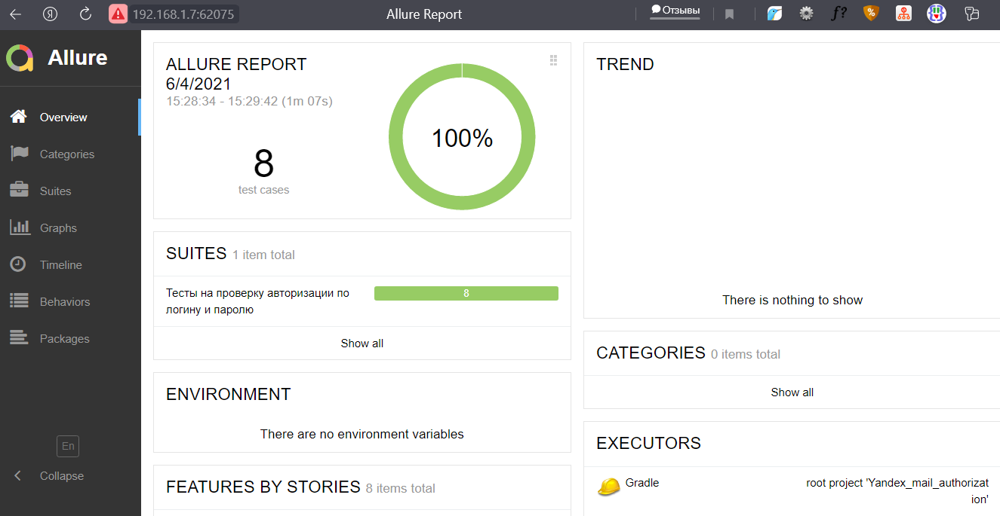
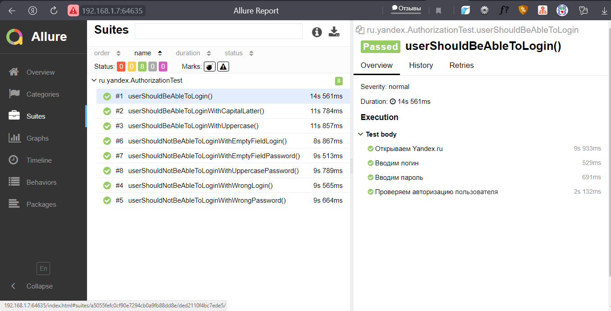

# Проверка функционала авторизации по логину и паролю на сайте http://yandex.ru

## Стэк технологий
| GitHub | IDEA | Java | Junit5 | Gradle | Selenide | Allure | 
|:-----:|:-----:|:----:|:------:|:------:|:--------:|:--------:|
| |  |  |  |  |  |  |   |  |

## UI тесты
- [X] :mango: Отображение корректной информации о  пользователе, после авторизации на странице
- [X] :banana: Отображение корректной информации о пользователе, если ввести в поле авторизации пользователя логин с первой заглавной буквы
- [X] :orange: Отображение корректной информации о пользователе, если ввести в поле авторизации пользователя логин в верхнем регистре (заглавными буквами)
- [X] :strawberry: Авторизация не завершится, если ввести в поле пароль данные в верхнем регистре
- [X] :watermelon: Авторизация не завершится, если ввести в поле логин не верные данные, не удалось войти в учетную запись
- [X] :grapes: Авторизация не завершится, если ввести в поле пароль не верные данные
- [X] :apple: Авторизация не завершится, если оставить поле логин пустым
- [X] :pear: Авторизация не завершится, если оставить поле пароль пустым

## Скриншоты
#### *Allure Report - простой и удобный генератор отчетов:*

  