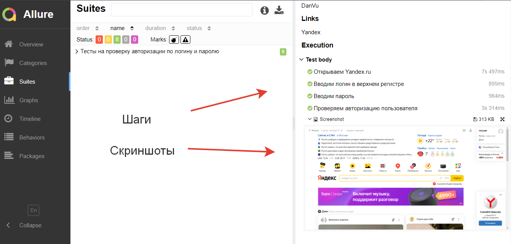
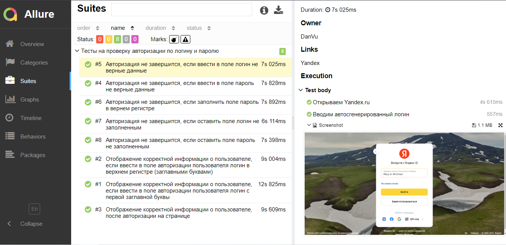

## Реализованы проверки функционала авторизации по логину и паролю на сайте http://yandex.ru

## Стэк технологий

## UI тесты
- [X] Отображение корректной информации о пользователе, после авторизации на странице
- [X] Отображение корректной информации о пользователе, если ввести в поле авторизации пользователя логин с заглавной буквы
- [X] Отображение корректной информации о пользователе, если ввести в поле авторизации пользователя логин в верхнем регистре 
- [X] Авторизация не завершится, если ввести в поле пароль данные в верхнем регистре
- [X] Авторизация не завершится, если ввести в поле логин не верные данные, не удалось войти в учетную запись
- [X] Авторизация не завершится, если ввести в поле пароль не верные данные
- [X] Авторизация не завершится, если оставить поле логин пустым
- [X] Авторизация не завершится, если оставить поле пароль пустым

## Скриншоты
#### *Allure Report - простой и удобный генератор отчетов:*

